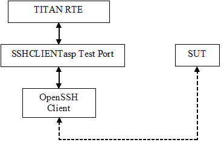

= SSHCLIENTasp Test Port for TTCN-3 Toolset with TITAN, Function Specification
:author: Gábor Szalai
:revnumber: 155 17-CNL 113 484, Rev. B
:revdate: 2012-05-15
:toc:

== How to Read This Document

This is the Function Specification for the SSHCLIENTasp test port. The SSHCLIENTasp test port is developed for the TTCN-3 Toolset with TITAN.

== Scope

The purpose of this document is to specify the functionality of the SSHCLIENTasp test port. The document is primarily addressed to the end users of the product. Basic knowledge of TTCN-3 and TITAN TTCN-3 Test Executor is valuable when reading this document (see <<_1, [1]>> and <<_2, [2]>>).

= General

The purpose of the SSHCLIENTasp test port is to adapt TITAN abstract test components using SSH connections to the real test system interface. The SSHCLIENTasp test port makes it possible to use remote SSH login from TTCN-3 via the OpenSSH client utility that is present in Unix systems. The test port offers SSH primitives to the test suite and communicates with the SUT.

The communication between the SSHCLIENTasp test port and the TITAN RTE is done by using the API functions described in <<_3, [3]>>.

The test port supports only client mode.

See the overview of the system below:

= Function Specification

== Implemetation

The test port implements the communication between the TITAN RTE and the SUT with the help of an external OpenSSH client utility. The OpenSSH client is executed in a pseudo terminal as a child process.

The OpenSSH client is widely available on standard Unix platforms, therefore in most of the cases no further configuration is needed.

=== Module Structure

The SSHCLIENTasp test port is implemented in the following TTCN-3 blocks:

* __SSHCLIENTasp_Types.ttcn__
* __SSHCLIENTasp_PortType.ttcn__

The file __SSHCLIENTasp_Types.ttcn__ defines the SSH ASPs. The port type is defined in __SSHCLIENTasp_PortType.ttcn__.

The C++ implementation of the test port is contained in the following files:

* __SSHCLIENTasp_PT.hh__
* __SSHCLIENTasp_PT.cc__

== Configuration

The configuration of the SSHCLIENTasp test port is done by the TITAN RTE configuration file.

The configuration file contains the following information for the SSHCLIENTasp test port:

* Host name of the SUT/IUT.
* Port number of the SUT/IUT.
* Username used for SSH login.
* Password used for SSH login.
* IP protocol version
* Read mode
* Possible prompt strings
* Suppress prompt
* Suppress echo
* Assign EOL
* Pseudo prompt
* Debug mode
* Status on success
* Additional parameters (one arbitrary parameter)

== Start Procedure

After the configuration is done, the user has to make sure that the target system is up and running. The SSH connection will not be initiated with the map operation. The connection can only be established by sending out an `ASP_SSH_Connect` ASP.

== Debugging

The type of information that will be logged can be categorized into two groups. The first one consists of information that shows the flow of the internal execution of the test port, e.g. important events, which function that is currently executing etc. The second group deals with presenting valuable data, e.g. presenting the content of a PDU. The logging printouts will be directed to the RTE log file. The user is able to decide whether logging is to take place or not by setting appropriate configuration data in the TITAN RTE configuration file.

For more information please refer to <<_3, [3]>> and <<_4, [4]>>.

== Error Handling

Erroneous behavior detected during runtime can be shown on the console and directed into the RTE log file based on the logging configuration section of the TITAN RTE configuration file. The following two types of messages are taken care of:

* Errors - information about errors detected is provided. If an error occurs the execution will stop immediately.
* Warnings - information about warnings detected is provided. The execution continues after the warning is shown.

== Closing Down

The test port will stop automatically and terminate before the end of each test case executed. As this test port is implemented with an external OpenSSH client which is executed in a forked pseudo terminal, it is recommended to explicitly close the SSH session at the end of each test case. This can be done with proper shell commands, for example, logout, exit.

The execution of the test suite can be stopped at any time by pressing `<Ctrl>-c`. When execution is interrupted with `<Ctrl>-c` the SSH child process will be intact. It should be stopped manually.

= Limitations

The test port does not support server mode.

The test port does not handle the messages about the fingerprint of the remote host. Before the test execution the remote host should be properly authenticated, and there should be a corresponding record in the __~/.ssh/known_hosts__ file (e.g. invoking ssh manually).

As this port is not a native implementation the limitations of the underlying OpenSSH client utility is also included.

= Terminology

*Pseudo terminal:* +
In http://en.wikipedia.org/wiki/Unix[Unix], a pseudo terminal is a http://en.wikipedia.org/wiki/Kernel_%28computer_science%29[kernel] device pair that simulates an ordinary http://en.wikipedia.org/wiki/Computer_terminal[terminal] but without the associated terminal hardware. Instead, a http://en.wikipedia.org/wiki/Computer_process[process] replaces the role of the underlying hardware for the pseudo terminal session.

= Abbreviations

IUT:: Implementation Under Test

OpenSSH:: Open Secure Shell

SSH:: Secure Shell

SUT:: System Under Test

TTCN-3:: Testing and Test Control Notation version 3

= References

[[_1]]
[1] ETSI ES 201 873-1 v3.1.1 (2005-06) +
The Testing and Test Control Notation version 3; Part 1: Core Language

[[_2]]
[2] TITAN User Guide

[[_3]]
[3] Programmer’s Technical Reference for TITAN TTCN-3 Test Executor

[[_4]]
[4] SCTPasp Test Port for TTCN-3 Toolset with TITAN, User’s Guide
