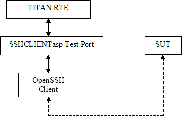
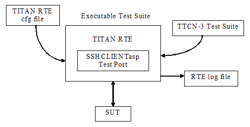

= SSHCLIENTasp Test Port for TTCN-3 Toolset with TITAN, User's Guide
:author: Zoltán Medve
:revnumber: 198 17-CNL 113 484, Rev. C
:revdate: 2012-05-15
:toc:

== About This Document

=== How to Read This Document

This is the User’s Guide for the SSHCLIENTasp test port. The SSHCLIENTasp test port is developed for the TTCN-3 Toolset with TITAN. This document should be read together with Function Specification <<_5, [5]>>.

=== Presumed Knowledge

The knowledge of the TITAN TTCN-3 Test Executor <<_2, [2]>> and the TTCN-3 language <<_1, [1]>> is essential.

== System Requirements

In order to operate the SSHCLIENTasp test port the following system requirements must be satisfied:

* TITAN TTCN-3 Test Executor R7A (1.7.pl0) or higher installed. For installation guide see <<_4, [4]>>.

NOTE: This version of the test port is not compatible with TITAN releases earlier than R7A.

* Any operating system supported by TITAN, while only tested on Solaris 8, SUSE Linux 9.1 and Cygwin 1.5.18-1.
* OpenSSH utility is present.

== Fundamental Concepts

The test port establishes SSH connection between the TTCN-3 test executor and SUT. The test port transmits and receives SSH messages between the TITAN RTE and the SUT.

The SSHCLIENTasp test port has many ASPs to control the behavior of the test port and to provide information about internal events. For details see <<abstract_service_primitives, Abstract Service Primitives>>

== Overview

The purpose of the SSHCLIENTasp test port is to adapt TITAN abstract test components using SSH connections to the real test system interface.

See the overview of a test system using SSHCLIENTasp test port below:

The SSHCLIENTasp test port forks a pseudo terminal and starts the OpenSSH client. After the connection is established it can send and receive abstract service primitives.

== Installation

Since the SSHCLIENTasp test port is used as a part of the TTCN-3 test environment this requires TTCN-3 Test Executor to be installed before any operation of the SSHCLIENTasp test port. For more details on the installation of TTCN-3 Test Executor see the TITAN Installation Guide ‎<<_4, [4]>>.

The test port is built on the SSH client utility. So it must be present for proper functioning.

NOTE: The test port files shall be added to the project or to the _Makefile_. On Linux systems the `-lutil` linker option shall be added to the _Makefile_, for example, `LINUX_LIB = -lutil`.

== Configuration

The executable test program behavior is determined via the RTE configuration file. This is a simple text file, which contains various sections (e.g. `[TESTPORT_PARAMETERS]`) after each other. The usual suffix of the RTE configuration file is _.cfg_. For further information about the configuration file see <<_2, [2]>>.

See the overview of the configuration process below:

[[SSHCLIENTasp_Test_Port_Parameters_in_the_RTE_Configuration_File]]
=== SSHCLIENTasp Test Port Parameters in the RTE Configuration File

In the `[TESTPORT_PARAMETERS]` section you can specify parameters that are passed to the test ports. Each parameter definition consists of a component name, a port name, a parameter name and a parameter value. The component name can be either an identifier or a component reference (integer) value. The port and parameter names are identifiers while the parameter value must always be a charstring (with quotation marks). Instead of component name or port name (or both of them) the asterisk ("*") sign can be used, which means "all components" or "all ports of the component". More information about the RTE configuration file can be found in ‎<<_2, [2]>>.

In the `[TESTPORT_PARAMETERS]` section the following parameters can be set for the SCTPasp test port. If the corresponding parameter is mandatory an (M), if it is optional an (O) and if it is conditional a \(C) is shown after its name:

* `debug (O)`
+
The parameter is optional, and can be used to enable debug logging. Available values: `_"yes"_`/`_"no"_`.
+
The default value is `_"no"_`.

* `statusOnSuccess (O)`
+
The parameter is optional, and can be used to enable status messages (`ASP_SSH_Status`) when operations affecting a remote host is successful. Available values: `_"yes"_`/`_"no"_`.
+
The default value is `_"no"_`.

* `remotehost (O)`
+
The parameter can be used to specify the remote host to connect to.
+
The default value is `_"localhost"_`.

* `remoteport (O)`
+
The parameter can be used to specify the remote port to connect to.
+
The default value is `_"22"_`.

* `additionalparameters (O)`
+
The parameter can be used to specify one arbitrary SSH parameter to the underlying OpenSSH client e.g. `_"-c3des"_`.
+
The default value is `_""_`.
+
For more information about the possible parameters read the OpenSSH client man pages.

* `ip_version (O)`
+
The parameter can be used to specify the version of the IP protocol that is used. Available values: `_"4"_` and `_"6"_`.
+
The default value is `_"4"_`.

* `EOL (O)`
+
The parameter can be used to specify the end of line type of the outgoing messages. Available values: `_"WINDOWS"_`, `_"UNIX"_` and `_"MAC"_`.
+
The default value is `_"UNIX"_`.
+
NOTE: It only affects the result if assignEOL is set to `_"yes"_`.

* `assignEOL (O)`
+
The parameter can be used to attach end of line signs to the outgoing messages. The type of the attached end of line sign is determined by the EOL test port parameter. Available values: `_"yes"_`/`_"no"_`.
+
The default value is `_"yes"_`.

* `supressEcho (O)`
+
The parameter can be used to suppress the echos received in reply to an `ASP_SSH` message. Available values: `_"yes"_`/`_"no"_`.
+
The default value is `_"no"_`.

* `supressPrompt (O)`
+
The parameter can be used to suppress the prompts received from the remote host. Available values: `_"yes"_`/`_"no"_`.
+
The default value is `_"no"_`.

* `pseudoPrompt (O)`
+
The parameter can be used to change every prompt received from the SUT to `ASP_SSH_PseudoPrompt`. Available values: `_"yes"_`/`_"no"_`.
+
The default value is `_"no"_`.
+
NOTE: This parameter is introduced in order to simplify detecting prompts in test cases where several kinds of prompts can occur.

* `readmode (O)`
+
The parameter can be used to specify when to pass incoming messages to the TITAN RTE. There are three read modes:
+
BUFFERED: the test port waits until prompt arrives and data received before the prompt is passed to the TITAN RTE in one `ASP_SSH` message.
+
UNBUFFERED: the test port waits until new line character is received and pass the whole received line to the TITAN RTE in one `ASP_SSH` message. If prompt is received before the line boundary then data before the prompt is passed to the TITAN RTE.
+
In buffered and unbuffered read modes the prompt is passed to the TITAN RTE according to the test port parameters `supressPrompt` and `pseudoPrompt`.
+
RAW: the test port does not wait. It passes incoming messages to the TITAN RTE as they are received. In this case the incoming messages always contain the prompt and the test port parameters `supressPrompt` and `pseudoPrompt` do not affect it.
+
Available values: `_"BUFFERED"_`, `_"UNBUFFERED"_` and `_"RAW"_`.
+
The default value is `_"BUFFERED"_`.

* `detectServerDisconnected (O)`
+
The parameter can be used to specify the behavior of the test port if the remote SSH connection is lost. If this parameter is set to `_"yes"_` connection loss is indicated by an incoming `ASP_SSH_Close` message. If it is set to "no" a TTCN error will be generated. Available values: `_"yes"_`/`_"no"_`.
+
The default value is `_"yes"_`.

* `prompt<prompt_id> \(C)`
+
The parameter can be used to specify the exact prompt strings used on the remote host. It is mandatory that at least one prompt or `regex_prompt` string must always be present. Several prompt strings can be added with different `prompt_ids`. The `prompt_id` is a positive integer and shall be assigned with strictly monotonic increasing values starting with `_"1"_`.
+
There is no default value.

* `regex_prompt<prompt_id> \(C)`
+
The parameter can be used to specify the prompt strings used on the remote host as TTCN-3 style regular expressions. It is mandatory that at least one prompt or `regex_prompt` string must always be present. Several `regex_prompt` strings can be added with different `prompt_ids`. The `prompt_id` is a positive integer and shall be assigned with strictly monotonic increasing values starting with `_"1"_`.
+
There is no default value.

* `raw_regex_prompt<prompt_id> \(C)`
+
The parameter can be used to specify the prompt string used on the remote host as regcomp supported POSIX regexp. It should have at least two subexpressions. The second subexpression selects the prompt. The regexp should match the entire buffer as it received.

* `empty_echo \(C)`
+
The `empty_echo` parameter determines whether the test port sends an empty charstring if the issued command has no printout. If the parameter is set to `_"yes"_` the test port sends an empty charstring to the test case before the prompt. If the value is set to `_"no"_` the test port do not send the empty charstring before the prompt.

= Using the Test Port in TTCN3

[[abstract_service_primitives]]
== Abstract Service Primitives

[[incoming-outgoing-asps]]
=== Incoming/Outgoing ASPs

[[asp-ssh]]
==== `ASP_SSH`

This ASP is used to send and receive user data.

=== Incoming ASPs

[[asp-ssh-close]]
==== `ASP_SSH_Close`

This ASP is used to indicate that the remote host has closed the SSH connection.

[[asp-ssh-pseudoprompt]]
==== `ASP_SSH_PseudoPrompt`

This ASP is used to indicate that a prompt has arrived from the SUT.

[[asp-ssh-status]]
==== `ASP_SSH_Status`

This ASP is used to indicate status information about operations that affects remote hosts. `ASP_SSH_Status` can be received after `ASP_SSH` or `ASP_SSH_Connect` has been sent. By default, it is received when the operation is failed but can be set to return information on success if the test port parameter `statusOnSuccess` is set to `_"yes"_`.

It has two fields:

* `status_code`
* `status_message`.

The following table contains the available values:

[width="100%",cols="20%,80%",options="header",]
|=====================================================================================
|*Status code* |*Status message*
|0 |OK!
|1 |ASP_SSH send error! No session!
|2 |ASP_SSH send error! Socket error!
|3 |ASP_SSH_Connect send error! This ASP can only be used if the connection is closed!
|=====================================================================================

=== Outgoing ASPs

[[asp-ssh-setprompt]]
==== `ASP_SSH_SetPrompt`

This ASP is used to add a new prompt string to the test port configuration.

It has two fields:

* `prompt_name`
* `prompt_value`

Prompt name has the same form as the name of the TITAN RTE configuration parameter `prompt<prompt_id>` which is described in section <<SSHCLIENTasp_Test_Port_Parameters_in_the_RTE_Configuration_File, SSHCLIENTasp Test Port Parameters in the RTE Configuration File>>. Prompt value is a charstring.

[[asp-ssh-setregexprompt]]
==== `ASP_SSH_SetRegexPrompt`

This ASP is used to add a new `regex_prompt` string to the test port configuration.

It has two fields:

* `prompt_name`
* `prompt_value`.

Prompt name has the same form as the name of the TITAN RTE configuration parameter `prompt<prompt_id>` which is described in section <<SSHCLIENTasp_Test_Port_Parameters_in_the_RTE_Configuration_File, SSHCLIENTasp Test Port Parameters in the RTE Configuration File>>. Prompt value is a charstring.

[[asp-ssh-clearprompt]]
==== `ASP_SSH_ClearPrompt`

This ASP is used to delete all of the previously defined prompt strings.

[[asp-ssh-setmode]]
==== `ASP_SSH_SetMode`

This ASP is used to set the read mode. It has one field with type of ReadMode which has three possible values: `_"BUFFERED"_`, `_"UNBUFFERED"_`, `_"RAW"_`.

[[asp-ssh-connect]]
==== `ASP_SSH_Connect`

This ASP is used to initiate an SSH connection. If it is sent on an active connection an `ASP_SSH_Status` will return with status code 3. It can be set to receive status information after successful connection establishments by setting test port parameter `statusOnSuccess` to `_"yes"_`.

[[asp-ssh-setuserid]]
==== `ASP_SSH_SetUserID`

This ASP is used to set the user id for the SSH connection to be established. It has one field with type of charstring.

[[asp-ssh-setremotehost]]
==== `ASP_SSH_SetRemoteHost`

This ASP is used to set the address of the remote host to connect to. It has one field with type of charstring.

[[asp-ssh-setremoteport]]
==== `ASP_SSH_SetRemotePort`

This ASP is used to set the port of the remote host to connect to. It has one field with type of charstring.

[[asp-ssh-setadditionalparameters]]
==== `ASP_SSH_SetAdditionalParameters`

This ASP is used to set one additional parameter to be applied to the SSH connection to be established. It has one field with type of charstring. For more information see section <<SSHCLIENTasp_Test_Port_Parameters_in_the_RTE_Configuration_File, SSHCLIENTasp Test Port Parameters in the RTE Configuration File>>.

== Using the Test Port

The first step is the configuration of the test port. Most of the parameters have a default value. The exceptions here are the `prompt` and `regex_prompt` parameters. It is mandatory to have at least one prompt string defined in the TITAN RTE configuration file. Configuration can also be done during runtime by ASPs.

After the configuration connection shall be established. If the connection is up, the remote host sends a message containing the string "Password:". Password shall be sent with an `ASP_SSH` message. Be aware that passwords will be written to the TITAN RTE log files!

After the test is finished the connection shall be closed with messages containing, for example, "logout", "exit". If `detectServerDisconnected` is set to `_"yes"_`, an `ASP_SSH_Close` will be returned.

NOTE: The answer time of the underlying OpenSSH client may be long for example in cases when a wrong host name or IP address is given to the test port and `ASP_SSH_Connect` is sent. Therefore, this time shall be taken into account in the test cases not to try to reconnect on an active connection. If you do an `ASP_SSH_Status` will return with status code 3.

= Error Messages

`*forkpty_solaris() setsid failed*`

Fork function call failed in `forkpty_solaris()`.

`*set_parameter(): Invalid parameter value: <value> for parameter <name>. Only yes and no can be used!*`

Invalid parameter value has been given. The value shall be `_"yes"_` or `_"no"_`.

`*set_parameter(): Invalid parameter value: <value> for parameter <name>. Valid values: 4 or 6!*`

Invalid parameter value has been given. The value shall be `_"4"_` or `_"6"_`.

`*set_parameter(): Invalid parameter value: <value> for parameter <name>. Valid values: WINDOWS, UNIX, MAC!*`

Invalid parameter value has been given. The value shall be `_"WINDOWS"_`, `_"UNIX"_` or `_"MAC"_`.

`*set_parameter(): Invalid parameter value: <value> for parameter <name>. Valid values: buffered, unbuffered, raw!*`

Invalid parameter value has been given. The value shall be `_"BUFFERED"_`, `_"UNBUFFERED" _`or `_"RAW"_`.

`*set_parameter(): PROMPT parameters should be given as PROMPT<number> := ``value''.*`

The parameter name and value shall be given in the form as `prompt<number> := "value". For example: prompt1 := dummy@"somewhere"`.

`*set_parameter(): error converting string "<substring>" in parameter name "name" to number.*`

The test port cannot convert the substring at the end of the parameter name to number. The substring starts after parameter name `prompt` or `regex_prompt`. This number is the ID of the prompt/regex_prompt string.

`*set_parameter(): Invalid parameter value: <value> for parameter <name>. PROMPT parameter must contain at least one character!*`

The prompt string shall contain at least one character.

`*set_parameter(): REGEX_PROMPT parameters should be given as REGEX_PROMPT<number> := &quot;value&quot;.*`

The parameter name and value shall be given in the form as `regex_prompt<number> := "value"``.

For example: `regex_prompt1 := “*t[a-z]#(3,3)rb@Proc_m0_s1:~> ”`.

`*set_parameter(): Invalid parameter value: <value> for parameter <name>. REGEX_PROMPT parameter must contain at least one character!*`

The `regex_prompt` string shall contain at least one character.

`*Event handler(): Socket error or the server closed the connection!*`

Socket error or the server closed the connection.

`*Missing mandatory parameter: at least one PROMPT or REGEX_PROMPT parameter must be provided!*`

It is mandatory to have at least one prompt or `regex_prompt` string in the configuration file.

`*Calling outgoing_send (ASP_SSH) failed! The SSH connection is closed!*`

ASP_SSH cannot be sent because the SSH connection is closed.

`*outgoing_send (ASP_SSH): Write to fd_ssh failed!*`

Writing to the file descriptor fd_ssh is failed.

`*Calling outgoing_send (ASP_SSH_Connect) failed! This ASP can only be used if the connection is closed!*`

`ASP_SSH_Connect` can only be sent when the connection is closed.

`*outgoing_send (ASP_SSH_Connect): fork() failed!*`

Fork function call failed. Child process cannot be started.

`*outgoing_send (ASP_SSH_Connect): execlp() failed!*`

Execlp function call failed. Child process cannot be started.

`*Cannot convert pattern "<pattern>" to POSIX-equivalent.*`

Cannot convert TTCN-3 style regular expression to its POSIX equivalent.

`*Function regcomp() failed while setting regexp pattern "<pattern>" as prompt: <error message>*`

Regcomp function call failed. Regular expression cannot be compiled to an executable form.

`*Error matching regexp prompt: <error message>*`

Matching the regex prompt with a string is failed.

`*Not enough memory.*`

There is not enough memory for the prompt list.

= Warning Messages

`*<port name>: unknown & unhandled parameter: <parameter name>*`

Unknown parameter has been found in the TITAN RTE configuration file.

`*(<port name>) cleanup(): Dropping partial message.*`

Cleanup has been called and the message buffer that is not empty. Partial message has been dropped.

`*(<port name>) cleanup(): Forked pseudo terminal with pid=<process id> could not be stopped, sending SIGKILL.*`

Process cannot be stopped. SIGKILL is sent.

`*(<port name>) cleanup(): Forked pseudo terminal is still running after SIGKILL with pid=<process id>, exiting.*`

Process is still running after SIGKILL.

`*(<port name>): Prompt_List::check(): Duplicated prompt string `<prompt>'.*`

Duplicated prompt string has been found in the prompt list.

`*(<port name>): Prompt_List::check(): Using prompt `pattern1' that is a substring of prompt `pattern2' might cause problems.*`

One of the prompts is a substring of the other.

= Examples

== Configuration File

[source]
----
[LOGGING]

FileMask := LOG_ALL | TTCN_DEBUG
ConsoleMask := TTCN_ERROR | TTCN_TESTCASE | TTCN_STATISTICS
LogFile := "%e.%h-%r.log"
LogEventTypes := Yes
LogSourceInfo := Yes

[MODULE_PARAMETERS]

[EXTERNAL_COMMANDS]

[MAIN_CONTROLLER]
TCPPort := 5678
NumHCs := 1
KillTimer := 30.0

[TESTPORT_PARAMETERS]

*.SSH_PCO.debug := "yes"
*.SSH_PCO.remote_host := "dummy"
*.SSH_PCO.remote_port := "22"
*.SSH_PCO.ip_version := "4"
*.SSH_PCO.EOL := "UNIX"
*.SSH_PCO.assignEOL := "yes"
*.SSH_PCO.supressEcho := "yes"
*.SSH_PCO.supressPrompt := "no"
*.SSH_PCO.pseudoPrompt := "no"
*.SSH_PCO.regex_prompt1:="*t[a-z]#(3,3)rb@Proc_m0_s1:~> "
*.SSH_PCO.readmode := "buffered"
*.SSH_PCO.detectServerDisconnected := "yes"
*.SSH_PCO.empty_echo := “yes”
*.SSH_PCO.raw_regex_prompt1 := "^(.*)(localhost@.*>)$"

[EXECUTE]
----

= Terminology

*Pseudo terminal:* +
In http://en.wikipedia.org/wiki/Unix[Unix], a pseudo terminal is a http://en.wikipedia.org/wiki/Kernel_%28computer_science%29[kernel] device pair that simulates an ordinary http://en.wikipedia.org/wiki/Computer_terminal[terminal] but without the associated terminal hardware. Instead, a http://en.wikipedia.org/wiki/Computer_process[process] replaces the role of the underlying hardware for the pseudo terminal session.

= Abbreviations

ASP:: Abstract Service Primitive

IUT:: Implementation Under Test

OpenSSH:: Open Secure Shell

RTE:: RunTime Environment

SSH:: Secure Shell

SUT:: System Under Test

TTCN-3:: Testing and Test Control Notation version 3

= References

[[_1]]
[1] ETSI ES 201 873-1 v3.1.1 (2005-06) +
The Testing and Test Control Notation version 3; Part 1: Core Language

[[_2]]
[2] TITAN User Guide

[[_3]]
[3] Programmer’s Technical Reference for TITAN TTCN-3 Test Executor

[[_4]]
[4] TITAN Installation Guide

[[_5]]
[5] SCTPasp Test Port for TTCN-3 Toolset with TITAN, Function Specification
